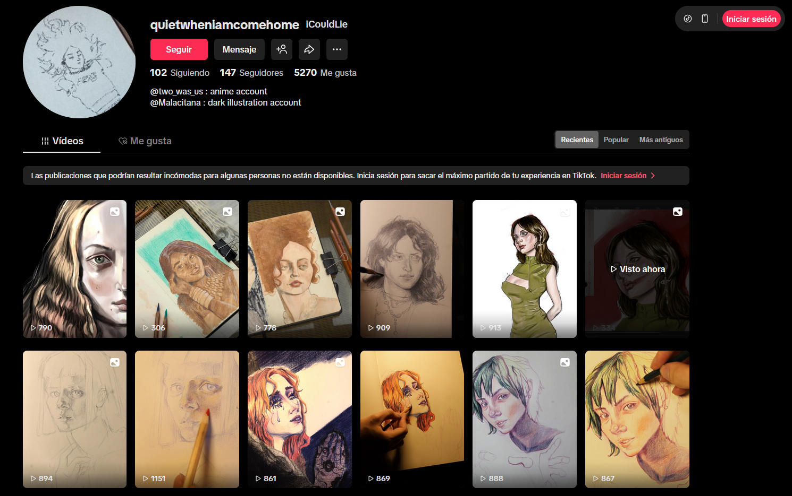
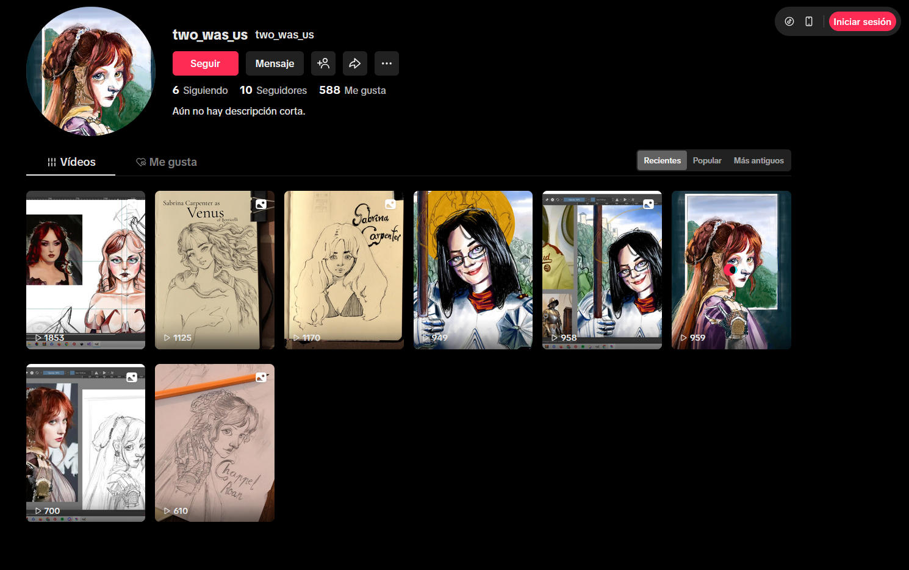
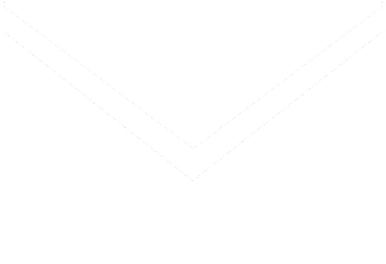

>[!NOTE]
>This profile has many traductions in other language as Spanish, German and French. Click on flag buttons to access traduced README .

# [:es:](README_ES.md) [:de:](README_DE.md) [:fr:](README_FR.md) 
>#### *"If you know the enemy and know yourself, you need not fear the result of a hundred battles. If you know yourself but not the enemy, for every victory gained you will also suffer a defeat. If you know neither the enemy nor yourself, you will succumb in every battle."* - *The Art of War* by **Sun Tzu**

# hi! I`m Sergio
### I specialize in Design UI and Graphic Design . Always I love experiment with new forms of artistic expression, such as code. I consider coding as a form to create new pleasant experiences for the user. In my free times you can find me trying to learn guitar and drawing illustrations. I like a good challenge and opportunities to meet diferent connections, so let's connect! 
---
## Tecnologies
### Dev tools
| Program Leanguages | FrameWorks / Libraries | Projects | 
| :---: | :--- | :--- |
| | 
 &nbsp;&nbsp; 
  |
|  |
|  |
| 
 
 | Swing |
|  | Tkinter / CustomKinter / GTK | [Monochromatic Palette Generator](https://github.com/jartibledev/plugin-monochromatic-palette-generator.git)   [Automatization in pixel art](https://github.com/jartibledev/plugin-generate-palette-to-step-gradient.git)
| | 
<t> </t> 
  |
---
### Design tools
| Area | Tools | Projects |
| :--- | :--- | :--- |
| Design UI | 

 |
| Page layout design | 
 
 |
| Vectorial illustration | 
   
 |
| Photography | 
 | Product illustration: [Kaio](https://www.behance.net/gallery/208584223/Kaio) |
| Illustration | 
 
 |  Fanart: [Anime](https://www.tiktok.com/@quietwheniamcomehome/video/7527694122442902806?is_from_webapp=1&sender_device=pc&web_id=7500310125333988886)   Digital Painting: [Terror Illustration](https://www.tiktok.com/@quietwheniamcomehome/video/7584111792876522774?is_from_webapp=1&sender_device=pc&web_id=7500310125333988886)   Advertising Illustration: [C.O](https://www.behance.net/gallery/206085157/CO-ad-illustration-project-%28fictional-project%29) |

## Interests:

### Art

>##### This is my artwork which I make with love:

#### [iCouldLie](https://www.tiktok.com/@quietwheniamcomehome)

#### [Two was two](https://www.tiktok.com/@two_was_us)

---
## Languages
| Language | Level |
|:---|:---:|
| :es: Spanish (native)|  |
| :uk: English (B1 Cambrigde) | |
| :de: German (learning) |   |
| :fr: French (low level) |   |
---
## Academic training
>### [Universidad de Málaga (UMA)](https://www.uma.es) (Arts Degree, 2018-2023)
>### [Universitat Politecnica de Valéncia (UPV)](https://www.upv.es) ( (Máster`s degree of Illustration and Design 2023-developing TFM)
### Courses
| Tool / Formation | Course |
| :--- | :--- |
| Indesing | Adobe Indesing`s extension college course of UMA |
| Illustrator | Adobe Illustrator`s extension college course of UMA |
| Textil illustration | Textil illustration`s extension college course of UMA |
---

## Contact me

  
 

<!-- --> 
<!-- -->

